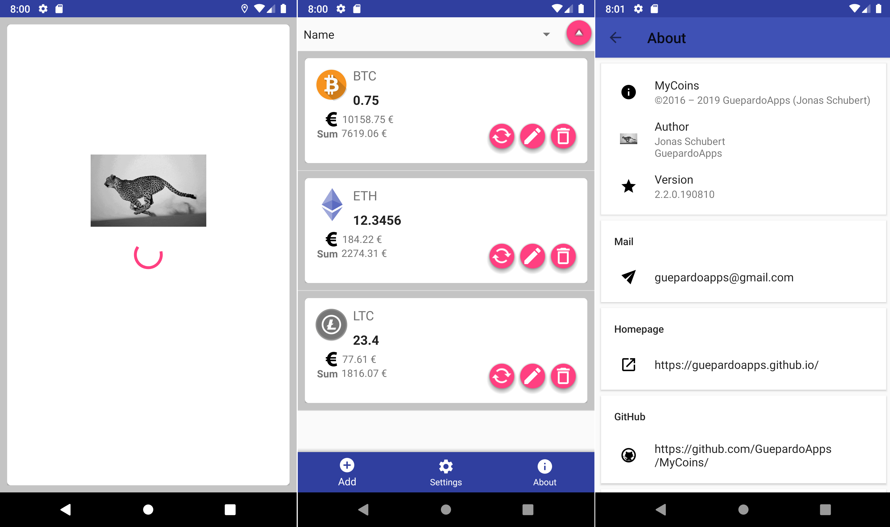

# MyCoins - master branch

Simple android application with material design to save the amount of coins you have and to check the value for each coins.

# Screenshots

### Upgrade warning
If you come from v1, please uninstall it and then install v2.

## License

MyCoins is distributed under the MIT license. [See LICENSE](LICENSE.md) for details.
